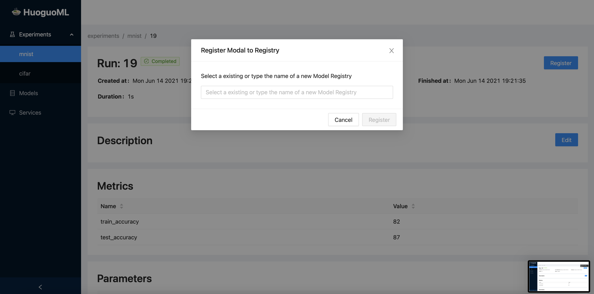
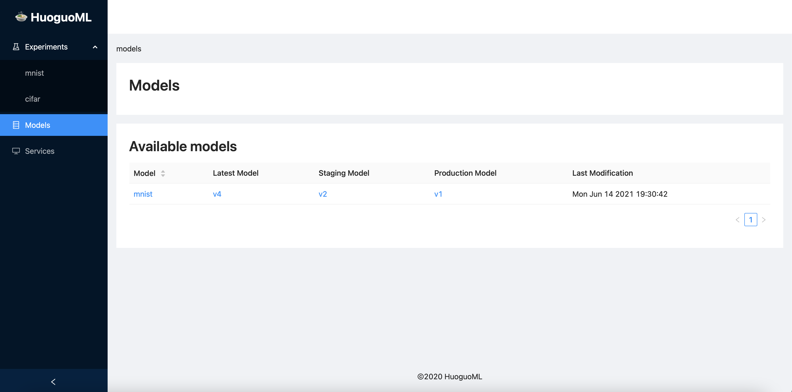
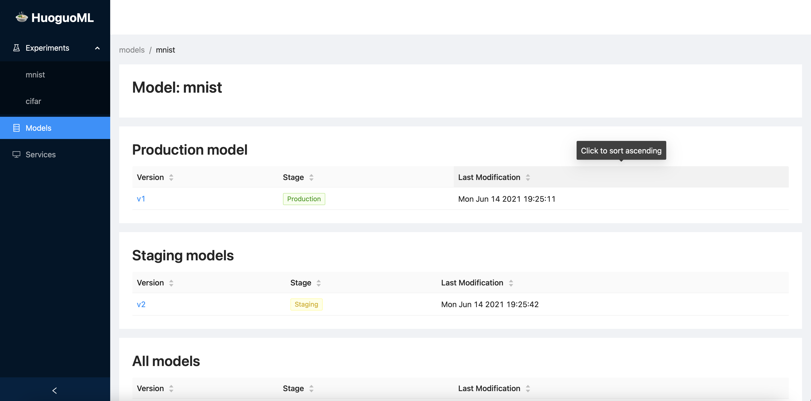

# HuoguoML Model Registry

## Introduction

After experimenting, you want to select a model and make it accessible for further use. For this, you can use the HuoguoML Model Registry, which is the central repository for all your models.

## Register Model

Open the HuoguoML dashboard and go to an experiment run. In the upper right corner, you will see a register button if the model experiment has logged model files \(for logging model files see [HuoguoML Tracking API](huoguoml-tracking-api.md#track-model-files)\). Click the button and enter the name of your registry or select the name of an existing registry:



On the dashboard, all registries are visible in a single table:



Feature of HuoguoML Registry is that each registered model has its own unique version with a stage. A model can be either in stage none, staging or production. In addition, there can be only one model in production and staging. To get a more detailed view of all models within a registry, you can click on the model:



To transfer a model to another stage, you must go to a model and click on the `Change Stage` button. You will be forwarded to a new page, where you can select the new stage

## Access Model Registry

### API

To retrieve the model files, you can create a GET request to the following URI:

```python
SERVER_HOST:SERVER_PORT/api/models/MODEL_NAME/MODEL_VERSION/files
```

This will give you a ZIP file where you have a folder called model where your model files are located. Also, in the root directory, you will find `huoguoml_meta`, which is a YAML file with the source run details.

### 


